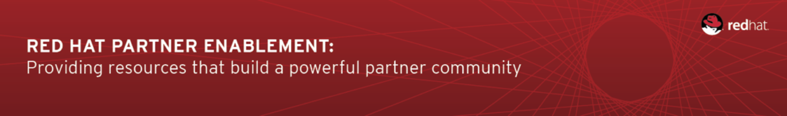
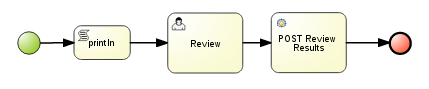
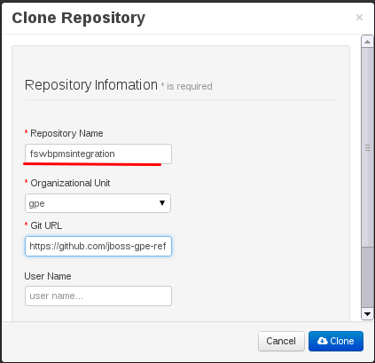
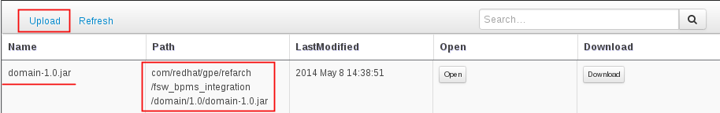
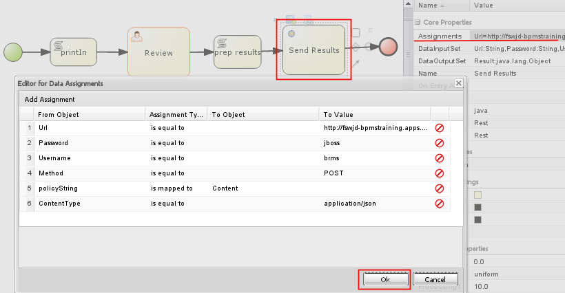
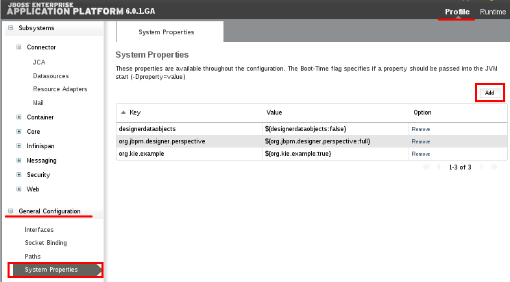
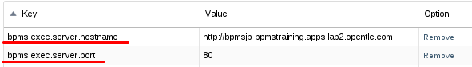
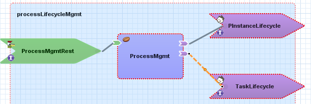
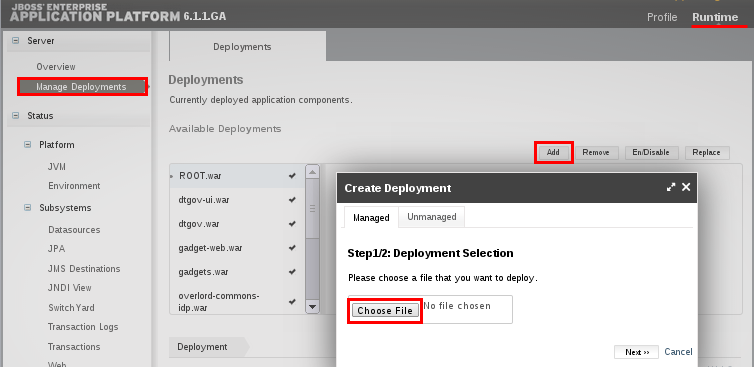
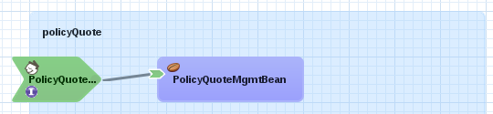

:data-uri:
:toc2:
:rpms: link:https://github.com/jboss-gpe-ose/jboss_bpm_soa_rpmbuild[RPMs]
:bpmcart: link:https://github.com/jboss-gpe-ose/openshift-origin-cartridge-bpms-full[Red Hat GPE's BPM Suite 6 cartridge]
:fswcart: link:https://github.com/jboss-gpe-ose/openshift-origin-cartridge-fsw-full[Red Hat GPE's FSW cartridge]
:bpmproduct: link:https://access.redhat.com/site/documentation/en-US/Red_Hat_JBoss_BPM_Suite/[Red Hat's BPM Suite 6 product]
:fswproduct: link:https://access.redhat.com/site/documentation/en-US/Red_Hat_JBoss_Fuse_Service_Works/[Red Hat's FSW product]
:osetools: link:https://access.redhat.com/site/documentation/en-US/OpenShift_Enterprise/2/html/Client_Tools_Installation_Guide/index.html[Openshift Enterprise Client Tools]
:remotejavaapi: link:https://access.redhat.com/site/documentation/en-US/Red_Hat_JBoss_BPM_Suite/6.0/html-single/Development_Guide/index.html#sect-Remote_Java_API[Remote Java API Client]

:numbered!:
[abstract]
== Fuse Service Works / BPM Suite 6 Integration

== Overview

=== BPM and SOA
Many enterprise software applications leverage a Business Process Management (BPM) tool.
The BPM solution maintains and manages the state of long-running business processes.
In an enterprise software application that leverages a BPM tool, it is highly recommended that business services continue to be implemented independent of the BPM tool and in adherence to SOA.
In particular, these business services should be course-grained, re-usable, contract-based, stateless and be exposed by standards based protocols.
During the life-cycle of a business process instance, nodes of that process instance should invoke the remote services that encapsulate the business logic.
Correspondingly, these business services should drive the life-cycle of process instances by invoking APIs provided by the BPM tool.

This _xPaaS_ reference architecture demonstrates a _process tier_ and _service tier_ interacting with each-other.
Specifically, a SwitchYard SCA application drives the life-cycle of a BPMN2 process instance whose state is managed remotely by BPM Suite 6.
To do so, the SwitchYard SCA application invokes the REST API of the BPM Suite 6 execution server using the stock RESTEasy composite binding implementation.
The _process tier_ is implemented in a Red Hat Openshift _gear_ provisioned with Red Hat JBoss BPM Suite 6.
The _service tier_ is implemented in a Red Hat Openshift _gear_ provisioned with Red Hat JBoss Fuse Service Works 6.

image::images/dep_arch.png[]

=== Standard REST Transport
Of potential interest to readers of this reference architecture are the SwitchYard SCA _Composite References_ that invoke the _Execution Server_ of BPM Suite 6.
These composite references (called:  PInstnaceLifecycle and TaskLifecycle) leverage the stock RESTEasy bindings that come included in SwitchYard.
An alternative approach to using the SwitchYard RESTEasy bindings is the {remotejavaapi} provided by BPM Suite 6.
The use of the BPM Suite 6 Remote Java Client API was not used in this reference architecture for the following reasons:

. avoid library version incompatibilities between Fuse Service Works and BPM Suite 6.
. emphasize the ability to invoke the BPM Suite 6 Execution Server in using a language-agnostic, standards based API and transport

=== Short and Long Running Process Instances
Fuse Service Works includes a _BPM Component_ that allows for BPMN process instances to be executed within the scope of a SwitchYard application.
Specifically, the BPM Component of FSW allows for starting and signaling of process instances from BPMN2 process definitions that are bundled in the SwitchYard application.
The BPM Component allows allows for invoking a limited subset of Human Task APIs for those process definitions that include a Human Task node.

In general, the use of the SwitchYard BPM Component tends to be useful when BPMN2 process definitions do not include a wait-state node.
Without a wait-state node, database persistence can be disabled.
Subsequently, execution of the process instance that is embedded in the SwitchYard application is very fast with a minimal resource foot-print.

For long-running process instances, often times it is useful to manage those process instances by a headless, centrally deployed BPM Suite 6 environment.
The Execution Server, process engine and Business Activity Monitoring components of BPM Suite 6 provide the full range of capabilities needed to manage long running processes.
The focus of this reference architecture is on this latter scenario:  long-running BPMN processes managed by a centrally deployed BPM Suite 6 environment and invoked by remote clients (specifically a SwitchYard application with REST composite reference bindings).

== Pre-Requisites
The remainder of this documentation provides instructions for installation, configuration and execution of this reference architecture.
The following is a list of pre-requisites:

. {osetools}
. Openshift Enterprise 2.* environment that has been installed with {rpms} needed to support Red Hat GPE's BPM Suite 6 and FSW cartridges.
Red Hat GPE's _Partner Demo System_ is one such environment.
Contact the Red Hat GPE team for more details.
. medium-sized Openshift Enterprise gear provisioned with {bpmcart} and mysql-5.
. medium-sized Openshift Enterprise gear provisioned with {fswcart} and mysql-5.
. ssh client
. maven 3.0.5 (or greater)
. git client
. familiarity with {bpmproduct}
. familiarity with {fswproduct}
. proficiency with basic *nix command line
. proficiency with vi

As is evidenced by these pre-requisites, the assumed BPM Suite 6 run-time environment for this reference architecture documentation is an Openshift Enterprise gear.
However, BPM Suite 6 and Fuse Service Works can be installed in non-PaaS local environments.
Thus it could be possible to execute this reference architecture in a non-PaaS local environment as well.

== Configuration and Deployment : Local Environment

=== local: Clone this reference architecture
This reference architecture will be cloned both in your local computer as well as in your remote BPM Suite 6 Openshift environment.
To clone this reference architecture in your local environment, execute the following:

-----
git clone https://github.com/jboss-gpe-ref-archs/fsw_bpms_integration.git
-----

Doing so will create a directory in your local computer called:  _fsw_bpms_integration_.
For the purposes of this reference architecture, this directory will be referred to as _$REF_ARCH_HOME_.

=== local: Build the Reference Architecture
This reference architecture includes various sub-projects that need to be built locally.
To build the various sub-projects, execute the following:

. cd $REF_ARCH_HOME
. mvn clean install

=== local: Domain model library deployment to FSW enabled Openshift gear
In $REF_ARCH_HOME, there is a directory called `domain`.
This directory contains the domain classes that will be referenced by other sub-projects of this reference architecture.
Notice that the domain classes are annotated to enable serialization via Java Architecture for XML Binding (JAXB).

In the previous step, the domain model library was built in your local environment.
The next requirement is to install the domain model library as a static module in your FSW enabled OpenShift gear.
The intent of deploying the domain model library as a static shared JBoss module is to make it available on the classpath of all of your SwitchYard applications.

. `cd $REF_ARCH_HOME`
. `scp -r domain/conf/com <your_fsw_openshift_url>:~/app-root/data/appModules/`
. `scp domain/target/domain-1.0.jar    <ssh_url_to_your_fsw_openshift_environment>:~/app-root/data/appModules/com/redhat/gpe/refarch/fsw_bpms_integration/domain/main/`

== Configuration and Deployment:  BPM Suite 6 

=== BPM Suite 6:  Define explicit dependency
In the previous step, the JAXB annotated domain classes were deployed to both the FSW and BPM Suite 6 enabled Openshift gears.
This step involves adding an explicit dependency to the BPM Suite 6 _Business-Central_ web application that references this static module.

. ssh <your_bpms_openshift_url>
. Edit the following file:  `~/bpms/standalone/deployments/business-central.war/WEB-INF/jboss-deployment-structure.xml`
.. Add the following to the list of dependencies:

-----
<module name="com.redhat.gpe.refarch.fsw_bpms_integration.domain" export="true"/>
-----

[start=4]
. Save the changes to the file
. Restart your OpenShift BPM Suite 6 instance

=== BPM Suite 6:  Clone this reference architecture
This reference architecture includes a business process called _policyQuoteProcessMap_ that includes a human task node followed by a Restful _Service Task_ .
It is this process whose life-cycle will be managed remotely via the Execution Server of BPM Suite 6.

Use the following steps to clone this reference architecture in BPM Suite 6:

. Log into the Business-Central web application of BPM Suite 6 and navigate to:  Authoring -> Administration.
. Select `Organizational Units` -> `Manage Organizational Units`
. Under `Organizational Unit Manager`, select the `Add` button
. Enter a name of _gpe_ and an owner of _jboss_. Click `OK`
. Clone this fsw_bpms_integration repository in BPM Suite 6
.. Select `Repositories` -> `Clone Repository` .  
.. Populate the _Clone Repository_ box as follows and then click _Clone_ :

Enter _fswbpmsintegration_ as the value of the _repository name_.  
The value of _Git URL_ is the URL to this reference architecture in github:

-----
https://github.com/jboss-gpe-ref-archs/fsw_bpms_integration.git
-----

Once successfully cloned, BPM Suite 6 will pop-up a new dialog box with the message:  _The repository is cloned successfully_

=== BPM Suite 6:  Add domain-model jar to classpath of _processTier_ project
Previously, this reference architecture's domain model was deployed to your FSW enabled Openshift gear as a shared static module.
This same approach could have been used to make available the domain model classes to the business-central web application of BPM Suite 6.
An alternative approach however specific to BPM Suite 6 is the ability to manually upload libraries to it's _Artifact Repository_ and then define dependencies in the KIE project to those newly  uploaded libraries.

. In your browser, navigate to :   Authoring -> Project Authoring .  Several exceptions related to the inability to find domain model classes should appear in the _Problems_ window.  This is to be expected at this time.
. navigate to :  Authoring -> Artifact Repository -> Upload
. In the _Artifact upload_ pop-up, select _Choose File_ and navigate to $REF_ARCH_HOME/domain/target/domain-1.0.jar in your local environment.
. Click Upload

[start=5]
. navigate to :  Authoring -> Project Authoring -> Tools -> Project Editor -> Dependencies:  Dependencies list
. click:  _Add from repository_ and click _Select_ on the newly uploaded _domain-1.0.jar_ library.
. click _Save_ and notice that upon doing so, the previous class not found related problems are resolved.

=== BPM Suite 6:  Modify parameters of RESTful Service Task
The _policyQuoteProcessMap_ process includes as its last node a RESTful Service Task.
This RESTful Service Task invokes a HTTP POST operation on a remote resource exposed by the _policyQuoteMgmt_ SwitchYard application (details of which will be discussed later in this reference architecture).
The values of this HTTP POST operation are configured in the parameters of the RESTful Service Task.
To customize these parameters for your environment, execute the following:

. Log into the Business-Central web application of BPM Suite 6 and navigate to:   Authoring -> Project Authoring.
. In the _Project Explorer_ section, drill-down into:  com.redhat.gpe.refarch.fsw_bpms_integration.processTier
. In the _Business Processes_ section, select:  _policyQuoteProcessMap_.
. In the _policyQuoteProcessMap_ process definition, click the last node entitled: _POST Review Results_.
. In the _Properties_ section of the BPM Designer, click the _Assignments_ property such that the _Editor for Data Assignments_ pop-up appears:

* Fill in the values for each _Assignment_ as follows:

. `Url`   :   http://<your_fsw_server_address>/policyQuoteMgmt/policy
. `ConnectTimeout`  :   5000
. `Password`  :   jboss
. `Username`  :   brms
. `Method`    :   POST
. `ReadTimeout`    :   5000

* Save the changes to the process definition.

=== BPM Suite 6:  Deploy _org.acme.insurance:policyquote:1.0_ KIE project

* Navigate to the _Project Editor_ and click the button at the top-right to `Build & Deploy`
** A light-green pop-up should appear indicating: _Build Successful_

The _org.acme.insurance:policyquote:1.0_ KIE project is now deployed as a maven artifact in your remote BPM Suite 6 environment and is registered with the embedded _Execution Server_.
The life-cycle of the project's business processes can now be remotely driven through the REST API of the _Execution Server_.
The next requirement to execute this reference architecture is to configure services in your remote FSW enabled Openshift environment.

== Configuration and Deployment:  Fuse Service Works

=== FSW:  Define System Properties
This reference architecture includes SwitchYard applications that define composite reference bindings that invoke the _Execution Server_ of a remote BPM Suite 6 environment.
In your FSW enabled environment, Java system properties will be added that indicate the network address of the BPM Suite 6 Execution Server.

* Point your browser to the JBoss Management Console of your FSW enabled Openshift environment.
* Navigate as follows:  _Profile -> General Configuration -> System Properties -> Add

* Add two additional System Properties as follows:

. bpms.exec.server.hostname :   http://<your_bpms_server_address>
. bpms.exec.server.port :   80

The value of _bpms.exec.server.hostname_ should be replaced with the server address of your BPM Suite 6 enabled Openshift environment.

=== FSW:  Create JMS Queue
This reference architecture includes a SwitchYard application that consumes a message from a queue.
The SwitchYard application uses data from the message to start and manage the life-cycle of remote BPM process instances.
This section describes the procedure to create this business queue in your FSW enabled Openshift gear.

. Open the JBoss EAP Management Console to your remote FSW enabled Openshift gear.
. Navigate to:  Profile -> Subsystems -> Messaging -> Destinations -> Default -> View -> Queues/Topics -> Add
. Populate the dialogue box as follows:
.. Name : processMgmtQueue
.. JNDI Names:  java:/queue/processMgmtQueue
. Click the _Save_ button

=== FSW:  Deploy _processLifecycleMgmt_ SwitchYard application

The purpose of the _processLifecycleMgmt_ application is to demonstrate a SwitchYard application as a client driving the lifecycle of a remote process instance.
Two SCA _Composite References_ are used to drive the life-cycle of a process instance:

. PInstanceLifecycle    : can invoke BPM Suite 6 Execution APIs to start and signal a process instance
. TaskLifecylce         : can invoke BPM Suite 6 Execution APIs to query, claim, start and complete human tasks

Import the serviceTier/processLifecycleMgmt project into JBoss Developer Studio (installed with the _Integration-Stack_ plugin) to view the details of these composite references.

The _processLifecycleMgmt_ SwitchYard application was built previously when this as part of the original build of this reference architecture.
Execute the following to deploy the _processLifecycleMgmt_ from your local environment to your FSW environment:

.  Point your browser to the JBoss Management Console of your FSW enabled Openshift environment
.  Navigate as follows:  _Runtime -> Manage Deployments -> Add -> Choose File
.  Select the $REF_ARCH_HOME/serviceTier/processLifecycleMgmt/target/processInstanceMgmt-1.1.1-p5-redhat-1.jar  artifact.

.  Once deployed, the artifact needs to be enabled.  Select the newly deployed processInstanceMgmt artifact and click the _enable_ button.

=== FSW:  Deploy _policyMgmt_ SwitchYard application

The purpose of the _policyMgmt_ application is to expose a RESTful service that any REST client (to include a RESTful Service Task node included in a BPMN2 process definition) can POST to.
To deploy the _policyMgmt_ application, follow the exact procedure used to deploy the _processLifecycleMgmt_ application.
This time, however, select the following artifact to deploy:

* $REF_ARCH_HOME/serviceTier/policyQuote/target/policyQuote-1.1.1-p5-redhat-1.jar

=== Exception Handling
* https://bugzilla.redhat.com/show_bug.cgi?id=1091061

== Execution:
Execution of this reference architecture begins with sending one or more messages to a business queue called _queue/processMgmtQueue_ .
The JMS Client is located in the *$REF_ARCH_HOME/loadTest* directory of this reference architecture.
The name of the class is *com.redhat.gpe.refarch.bpm_jms_exec_server.loadtest.JMSClient*.
Note that this class also extends the JMeter AbstractJavaSamplerClient class.
Use of JMeter with this reference architecture will be discussed in the next section of this documentation.

=== Port-forward Hornetq port
The HornetQ broker embedded in your remote FSW enabled Openshift environment listens by default on port 5445.
This port is not open in an Openshift environment.
Subsequently, port 5445 needs to be tunneled using ssh from your local to your remote FSW environments.

.Obtain the IP address for the OSE internal NIC
----------
ssh <ssh_url_to_your_fsw_openshift_environment> 'echo $OPENSHIFT_FSW_IP'
----------

.Port Forwarding command for HornetQ access
----------
ssh -N -L localhost:5445:<ipaddress from previous step>:5445 <ssh_url_to_your_fsw_openshift_environment>
----------

While the port forwarding process is running, the HornetQ broker can be accessed on the local computer at `localhost:5445`.
Use `Ctrl+c` to kill port forwarding.

=== Execute JMeter client
By default, the configuration in $REF_ARCH_HOME/loadtest will direct JMeter to send one JMS message (from only one thread) to the JMS broker at localhost:5445.
Execute a smoke test of your deployed reference architecture via the following:

.  cd $REF_ARCH_HOME/loadtest
.  mvn clean verify

== To-Do
* change such that org.acme.insurance domain model classes are added as maven dependencies to business-central.
* specify role used to query for potential tasks
* demonstrate invocation of the following BPM Suite 6 task operation:  claimnextavailable
* implement ability to signal a process instance in the PInstanceLifecyle composite reference
* error handling when substitution properties in URL of REST invocation are not valid
** currently rolls back outside of scope of ProcessMgmtBean
** causes multiple invocations of startProcess call)
