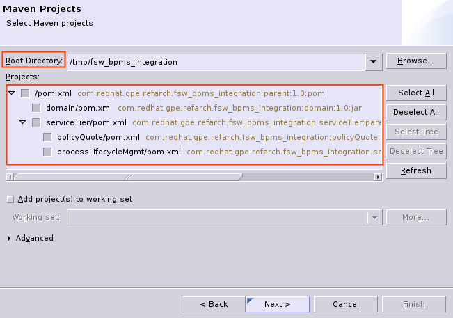

:data-uri:
:toc2:
:rpms: link:https://github.com/jboss-gpe-ose/jboss_bpm_soa_rpmbuild[RPMs]
:bpmcart: link:https://github.com/jboss-gpe-ose/openshift-origin-cartridge-bpms-full/blob/master/doc/cart_doc.adoc[Red Hat GPE's BPM Suite 6 cartridge]
:fswcart: link:https://github.com/jboss-gpe-ose/openshift-origin-cartridge-fsw-full[Red Hat GPE's FSW cartridge]
:bpmproduct: link:https://access.redhat.com/site/documentation/en-US/Red_Hat_JBoss_BPM_Suite/[Red Hat's BPM Suite 6 product]
:fswproduct: link:https://access.redhat.com/site/documentation/en-US/Red_Hat_JBoss_Fuse_Service_Works/[Red Hat's FSW product]
:osetools: link:https://access.redhat.com/site/documentation/en-US/OpenShift_Enterprise/2/html/Client_Tools_Installation_Guide/index.html[Openshift Enterprise Client Tools]
:remotejavaapi: link:https://access.redhat.com/site/documentation/en-US/Red_Hat_JBoss_BPM_Suite/6.0/html-single/Development_Guide/index.html#sect-Remote_Java_API[Remote Java API Client]
:executionserver: link:https://access.redhat.com/site/documentation/en-US/Red_Hat_JBoss_BPM_Suite/6.0/html-single/Development_Guide/index.html#chap-REST_API[Exection Server]
:classloaderincompatibilities: link:https://bugzilla.redhat.com/show_bug.cgi?id=1051739[classload incompatibilities]
:mwlaboverviewsetup: link:http://people.redhat.com/jbride/labsCommon/setup.html[`Middleware Lab Overview and Set-up`]
:mvnrepos: link:https://access.redhat.com/documentation/en-US/Red_Hat_JBoss_Fuse_Service_Works/6/html-single/Installation_Guide/index.html#chap-Maven_Repositories[`Maven Repositories`]
:installintegrationstack: link:https://access.redhat.com/documentation/en-US/Red_Hat_JBoss_Fuse_Service_Works/6/html-single/Installation_Guide/index.html#Install_JBoss_Developer_Studio_Integration_Stack[`Install Integration Stack`]

image::images/rhheader.png[width=900]

:numbered!:
[abstract]
== Fuse Service Works / BPM Suite 6 Integration

:numbered:

== Overview

=== BPM and SOA
Many enterprise software applications leverage a Business Process Management (BPM) tool.
The BPM solution maintains and manages the state of long-running business processes.
In an enterprise software application that leverages a BPM tool, it is highly recommended that business services continue to be implemented independent of the BPM tool and in adherence to SOA.
In particular, these business services should be course-grained, re-usable, contract-based, stateless and be exposed by standards based protocols.
During the life-cycle of a business process instance, nodes of that process instance should invoke the remote services that encapsulate the business logic.
Correspondingly, these business services should drive the life-cycle of process instances by invoking APIs provided by the BPM tool.

This _xPaaS_ reference architecture demonstrates a _process tier_ and _service tier_ interacting with each-other.
Specifically, a SwitchYard SCA application drives the life-cycle of a BPMN2 process instance whose state is managed remotely by BPM Suite 6.
To do so, the SwitchYard SCA application invokes the REST API of the BPM Suite 6 execution server using the stock RESTEasy composite binding implementation.

The _process tier_ is implemented in a Red Hat Openshift _gear_ provisioned with Red Hat JBoss BPM Suite 6.
The _service tier_ is implemented in a Red Hat Openshift _gear_ provisioned with Red Hat JBoss Fuse Service Works 6.

image::images/service_interation.png[]

=== Standard REST Transport

==== SwitchYard Application Client
This reference architecture includes a SwitchYard application with SCA _Composite References_.
These composite references (called:  PInstanceLifecycle and TaskLifecycle) leverage the stock RESTEasy bindings that come included in SwitchYard.
The RESTEasy bindings are used to invoke the _Execution Server_ of BPM Suite 6.
An alternative approach to using the SwitchYard RESTEasy bindings is the {remotejavaapi} provided by BPM Suite 6.
The _Remote Java Client API_ is not used in the SwitchYard application of this reference architecture for the following reasons:

. avoidance of {classloaderincompatibilities} between Fuse Service Works and BPM Suite 6.
. emphasis on the ability to invoke the BPM Suite 6 Execution Server in a language-agnostic, standards based manner

==== BPM Suite 6 Execution Server
BPM Suite 6 provides an {executionserver} to allow for remote interaction with the following run-time functionality:

.  BPM Suite 6 Artifact Repository
.  Deployment Unit management
.  Process, Human Task and Rules engines (this functionality is also known as:  Runtime REST API)

The scope of this reference architecture is limited to interaction with the Process and Human Task engines only via the _Runtime REST API.

The _Runtime REST API_ provided by the BPM Suite 6 Execution Server allows for a couple of styles of invocation and content types:

. _Runtime operations_ : conventional REST API that accepts a payload whose content-type is either _application/xml_ or _application/json_. Responses back to the HTTP client are of type:  _application/xml_
. _Execute operations_ : XML over HTTP style API that requires a Execution Server specific payload called the: _CommandObject_ .  

One advantage of the _Execute operations_ approach is that it is the only option for sending multiple commands in a single invocation.
The current version of this reference architecture is focused on use of the _Runtime operations_ approach only.
A future version of this reference architecture will also demonstrate use of the _Execute operations_ approach.

=== Appropriate use of the FSW _BPM Component_
Fuse Service Works includes a _BPM Component_ that allows for BPMN process instances to be executed within the scope of a SwitchYard application.
Specifically, the BPM Component of FSW allows for starting and signaling of process instances from BPMN2 process definitions that are bundled in those SwitchYard applications.
The FSW BPM Component however is not intended to be a BPM product.
A few considerations regarding its use are as follows:

. The FSW BPM Component allows for invoking only a limited subset of Human Task APIs (for those process definitions that include a Human Task node).
. Does not include Business Activity Monitoring tooling
. Does not include any of the web tooling found in the Business-Central web application of BPM Suite 6
. Its use still requires a subscription to the BPM Suite 6 product

In general, the FSW BPM Component tends to be useful with BPMN2 process definitions that tend to be short-lived and do not include a wait-state node.
Without a wait-state node, database persistence can be disabled.
Subsequently, execution of the process instance that is embedded in the SwitchYard application is very fast with a minimal resource foot-print.
The process instance begins and completes within the same scope of the request that invoked the SwitchYard application.
Tooling used to create the BPMN2 process definition is typically via the jbpm plugin (bundled as part of the  Integration Stack suite of plugins) for JBoss Developer Studio.

For long-running process instances, often times it is useful to manage those process instances in a centrally deployed, highly available BPM Suite 6 environment.
The Execution Server, process engine and Business Activity Monitoring components of BPM Suite 6 provide the full range of capabilities needed to manage long running processes.
The focus of this reference architecture is on this latter scenario:  long-running BPMN processes managed by a centrally deployed BPM Suite 6 environment and invoked by remote clients (specifically a SwitchYard application with REST composite reference bindings).

=== Deployment Architecture

image::images/DeploymentDiagram.png[width=760]

This reference architecture consists of various components:

==== OpenShift Enterprise 2.* FSW App
Your Fuse Service Works environment will consist of the following :

. *mysql database* : leveraged by FSW for internal needs only.
. *hornetq broker* : manages a queue called 'processMgmtQueue'.  
To initiate the reference architecture, a JMeter client pushes a message to this queue.
Associated with this queue is a messageSelector of:  OPERATION = 'REST_API'.
A message sent to this queue with a String property that matches this selector will get routed to the _processMgmt_ bean component of the _processLifecycleMgmt_ SwitchYard application.
. *processLifecycleMgmt* SwitchYard app : primary focal point of this reference architecture.
Contains the _ProcessMgmt_ component service and REST composite reference bindings that drive the life-cycle of a process instance and human task managed by remote BPM Suite 6 engines.
. *policyQuote* SwitchYard app : simple RESTful service that executes some simple business logic.
Invoked as the final step of a remote business process.

==== OpenShift Enterprise 2.* BPM Suite 6 App
Your BPM Suite 6 environment will consist of the following :

. *Execution Server* : BPM Suite 6 component that provides both a REST and JMS API to the process and rules engines.
For the purposes of this reference architecture, only the REST API will be invoked.
In addition to providing an API, the Execution Server also includes two critical BPM components:
.. Process Engine:  manages life-cycle and wait-states of BPMN2 process definitions.
.. Human Task Engine:  manages life-cycle of human task nodes as per the WS-HumanTask specification.
. *BPM Console* : User interface to manually manage all functionality related to BPM Suite 6.
In this reference architecture, the BPM Console will be used to create and organization unit, clone this repository and deploy a _KIE_ project.
. *com.redhat.gpe.ref_arch.fsw_bpms_integration:processTier:1.0* : BPM Suite 6 _KIE_ project.
Contains a process definition with:
..  human task node 
.. RESTful ServiceTask node:  invokes a remote SOA service to trigger execution of business logic.
. *mysql database* : leveraged by BPM Suite 6 to persist process _wait-state_, human-task and business activity monitoring data.
. *Artifact Repository* : BPM Suite 6 repository where external libraries can be added to the classpath of a _KIE_ project.
The domain model classes of this reference architecture will be made available to the _KIE_ project by uploading to the BPM Suite 6 artifact repository.
. *GIT Repository* : version control system used by BPM Suite 6 to manage design-time artifacts such as rules and process definitions.

==== Local Environment
Your local environment will consist of the following :

. *JBoss Developer Studio* : Eclipse based IDE containing the _Integration Stack_ suite of plugins.
Used to develop SwitchYard applications to include the two apps used in this reference architecture:  _processLifecycleMgmt_ and _policyQuote_.
. *JMeter* : load-harness tool used to initiate execution of this reference architecture.

=== Message Flow

The previous section of this documenation introduced the various components that make up this reference architecture.
With that in mind, the following is a sequence diagram that depicts the message flow between these components.
Notice the significant involvement of the _ProcessLifecycleMgmt_ SwitchYard application to invoke the remote Process and Human Task engines.

image::images/sequence_diagram.png[width=760]

=== Red Hat Support
This reference architecture involves the integration between two Red Hat products:

. Red Hat JBoss Fuse Service Works
. Red Hat BPM Suite 6

A solution that leverages these products will require subscriptions to both products.
Red Hat will support the out-of-the-box components and features of each product.
The integration between these two products as proposed in this reference architecture, however, is custom and not supported via a Red Hat subscription.

== Pre-Requisites
The remainder of this documentation provides instructions for installation, configuration and execution of this reference architecture in Red Hat's Partner Demo System.
The following is a list of pre-requisites:

. OPENTLC-SSO credentials
+
`OPENTLC-SSO` user credentials are used to log into the Red Hat Partner Demo System (PDS).
If you do not currently have a `OPENTLC-SSO` userId, please email: `OPEN-program@redhat.com`.

. Familiarity with Partner Demo System
+
If you are not already familiar with Red Hat's `Partner Demo System`, please execute what is detailed in the {mwlaboverviewsetup} guide.
Doing so will ensure that you are proficient with the tooling and workflow needed to complete this reference architecture in an OpenShift Platform as a Service environment.

. Familiarity with {bpmproduct}
. Familiarity with {fswproduct}

== Configuration and Deployment : Local Environment
This reference architecture will be cloned both in your local computer as well as in your remote BPM Suite 6 Openshift environment.

=== local: Ensure installation of `IntegrationStack` plugins
The `IntegrationStack` suite of JBoss Developer Studio plugins is a requirement for this reference architecture.
If you have not already done so, ensure that this suite of plugins is installed as per the {installintegrationstack} section of the FSW installation guide.

=== local: Ensure proper config of settings.xml
A portion of this reference architecture includes a SwitchYard application that will be imported into your JBDS via maven.
At this time make sure that your maven settings.xml is configured to reference the supported on-line or off-line Fuse Service Works maven repository.
This procedure is discussed in the {mvnrepos} section of the Fuse Service Works Installation Guide.

=== local: Clone this reference architecture

To clone this reference architecture in your local environment, execute the following:

. Open the `Git` perspective of JBDS.
. In the `Git Repositories` panel, click the link that allows you to `Clone a Git Repository and add the clone to this view`
. A pop-up should appear with a name of `Source Git Repository`
. In the `URI` field, enter the following:
+
-----
https://github.com/jboss-gpe-ref-archs/fsw_bpms_integration.git
-----

. Click `Next`
+

. Continue to click `Next` through the various screens
+
Optional:  On the pop-up screen entitled `Local Destination`, change the default value of the `Directory` field to your preferred location on disk.

. On the last screen of the pop-up, click `Finish`
+
Doing so will clone this `fsw_bpms_integration` project to your local disk

. In JBDS, switch to the `Project Explorer` panel and navigate to:  `File -> Import -> Maven -> Existing Maven Projects`
. In the `Root Directory` field of the `Maven Projects` pop-up, navigate to the location on disk where the `fsw_bpms_integration` project was just clone to.
+

. Your `Project Explorer` panel should now include the following mavenized projects
+

=== local: Build the Reference Architecture
This reference architecture includes various sub-projects that need to be built locally.
To build the various sub-projects, execute the following:

. cd $REF_ARCH_HOME
. mvn clean install

=== local: Domain model library deployment to FSW enabled Openshift gear
In $REF_ARCH_HOME, there is a directory called `domain`.
This directory contains the domain classes that will be referenced by other sub-projects of this reference architecture.
Notice that the domain classes are annotated to enable serialization via Java Architecture for XML Binding (JAXB).

In the previous step, the domain model library was built in your local environment.
The next requirement is to install the domain model library as a static module in your FSW enabled OpenShift gear.
The intent of deploying the domain model library as a static shared JBoss module is to make it available on the classpath of all of your SwitchYard applications.

. `cd $REF_ARCH_HOME`
. `scp -r domain/conf/com <your_fsw_openshift_url>:~/app-root/data/appModules/`
. `scp domain/target/domain-1.0.jar    <ssh_url_to_your_fsw_openshift_environment>:~/app-root/data/appModules/com/redhat/gpe/refarch/fsw_bpms_integration/domain/main/`

== Configuration and Deployment:  BPM Suite 6 

=== BPM Suite 6:  Clone this reference architecture
This next section of the reference architecture assumes that you have an Openshift gear provisioned with BPM Suite 6 using {bpmcart}.

This reference architecture includes a business process called _policyQuoteProcessMap_ that includes a human task node followed by a Restful _Service Task_ .
It is this process whose life-cycle will be managed remotely via the Execution Server of BPM Suite 6.

image::images/processTier_bpmn.png[]

Use the following steps to clone this reference architecture in BPM Suite 6:

. Log into the Business-Central web application of BPM Suite 6 and navigate to:  Authoring -> Administration.
. Select `Organizational Units` -> `Manage Organizational Units`
. Under `Organizational Unit Manager`, select the `Add` button
. Enter a name of _gpe_ and an owner of _jboss_. Click `OK`
. Clone this fsw_bpms_integration repository in BPM Suite 6
.. Select `Repositories` -> `Clone Repository` .  
.. Populate the _Clone Repository_ box as follows and then click _Clone_ :

image::images/clone_repo.png[]

Enter _fswbpmsintegration_ as the value of the _repository name_.  
The value of _Git URL_ is the URL to this reference architecture in github:

-----
https://github.com/jboss-gpe-ref-archs/fsw_bpms_integration.git
-----

Once successfully cloned, BPM Suite 6 will pop-up a new dialog box with the message:  _The repository is cloned successfully_

=== BPM Suite 6:  Add domain-model jar to classpath of _processTier_ project
Previously, this reference architecture's domain model was deployed to your FSW enabled Openshift gear as a shared static module.
This same approach could have been used to make available the domain model classes to the business-central web application of BPM Suite 6.
BPM Suite 6 however provides the ability to manually upload libraries to it's _Artifact Repository_ and then define dependencies in the KIE project to those newly  uploaded libraries.

. In your browser, navigate to :   Authoring -> Project Authoring .  Several exceptions related to the inability to find domain model classes should appear in the _Problems_ window.  This is to be expected at this time.
. navigate to :  Authoring -> Artifact Repository -> Upload
. In the _Artifact upload_ pop-up, select _Choose File_ and navigate to $REF_ARCH_HOME/domain/target/domain-1.0.jar in your local environment.
. Click Upload

image::images/uploaded_domain.png[]

[start=5]
. navigate to:  Authoring -> Project Authoring -> Tools -> Project Editor -> Dependencies:  Dependencies list.
. click:  _Add from repository_ followed by _Select_ on the newly uploaded _domain-1.0.jar_ library.
. click _Save_ .

image::images/add_domain_dep.png[]

Notice that upon saving the _processTier_ project, the previous class related problems are now resolved.

=== BPM Suite 6:  Modify parameters of RESTful Service Task
The _policyQuoteProcessMap_ process includes as its last node a RESTful Service Task.
This RESTful Service Task invokes a HTTP POST operation on a remote resource exposed by the _policyQuoteMgmt_ SwitchYard application (details of which will be discussed later in this reference architecture).
The values of this HTTP POST operation are configured in the parameters of the RESTful Service Task.
To customize these parameters for your environment, execute the following:

. Log into the Business-Central web application of BPM Suite 6 and navigate to:   Authoring -> Project Authoring.
. In the _Project Explorer_ section, drill-down into:  com.redhat.gpe.refarch.fsw_bpms_integration.processTier
. In the _Business Processes_ section, select:  _policyQuoteProcessMap_.
. In the _policyQuoteProcessMap_ process definition, click the last node entitled: _POST Review Results_.
. In the _Properties_ section of the BPM Designer, click the _Assignments_ property such that the _Editor for Data Assignments_ pop-up appears:

image::images/mod_service_task.png[]

* Fill in the values for each _Assignment_ as follows:

. `Url`           is equal to   `http://<your_fsw_server_address>/policyQuoteMgmt/policy`
. `Password`      is equal to   `brms`
. `Username`      is equal to   `jboss`
. `Method`        is equal to   `POST`
. `policyString`  is mapped to  `Content`
. `ContentType`   is equal to   `application/json`

* Save the changes to the process definition.

=== BPM Suite 6:  Deploy _org.acme.insurance:policyquote:1.0_ KIE project

* Navigate to the _Project Editor_ and click the button at the top-right to `Build & Deploy`
** A light-green pop-up should appear indicating: _Build Successful_

The _org.acme.insurance:policyquote:1.0_ KIE project is now deployed as a maven artifact in your remote BPM Suite 6 environment and is registered with the embedded _Execution Server_.
The life-cycle of the project's business processes can now be remotely driven through the REST API of the _Execution Server_.
The next requirement of this reference architecture is to configure services in your remote FSW enabled Openshift environment.

== Configuration and Deployment:  Fuse Service Works

This next section of the reference architecture assumes that you have an Openshift gear provisioned with Fuse Service Works using {fswcart}.

=== FSW:  Define System Properties
This reference architecture includes SwitchYard applications that define composite reference bindings that invoke the _Execution Server_ of a remote BPM Suite 6 environment.
In your FSW enabled environment, Java system properties will be added that indicate the network address of the BPM Suite 6 Execution Server.

* Point your browser to the JBoss Management Console of your FSW enabled Openshift environment.
* Navigate as follows:  _Profile -> General Configuration -> System Properties -> Add
image::images/add_sys_props.png[]

* Add two additional System Properties as follows:

image::images/sys_props_added.png[]

. bpms.exec.server.hostname :   <your_bpms_server_address>
. bpms.exec.server.port :   80

The value of _bpms.exec.server.hostname_ should be replaced with the server address of your BPM Suite 6 enabled Openshift environment.

=== FSW:  Create JMS Queue
This reference architecture includes a SwitchYard application that consumes a message from a queue.
The SwitchYard application uses data from the message to start and manage the life-cycle of remote BPM process instances.
This section describes the procedure to create this business queue in your FSW enabled Openshift gear.

. Open the JBoss EAP Management Console to your remote FSW enabled Openshift gear.
. Navigate to:  Profile -> Subsystems -> Messaging -> Destinations -> Default -> View -> Queues/Topics -> Add
. Populate the dialogue box as follows:
.. Name : processMgmtQueue
.. JNDI Names:  java:/queue/processMgmtQueue
. Click the _Save_ button

=== FSW:  Deploy _processLifecycleMgmt_ SwitchYard application
image::images/processMgmt-app.png[]

==== FSW: Understand _processLifecycleMgmt_ SY app
The purpose of the _processLifecycleMgmt_ application is to demonstrate a SwitchYard application as a client driving the lifecycle of a remote process instance.

Import the serviceTier/processLifecycleMgmt project into JBoss Developer Studio (make sure the _Integration-Stack_ suite of plugins are installed).
Take the time at this point to study the _processLifecycleMgmt_ SwitchYard application in JBoss Developer Studio.
Pay particular attention to:

* switchyard.xml : Two SCA _Composite References_ are used to drive the life-cycle of a process instance:
** PInstanceLifecycle    : invokes BPM Suite 6 Execution APIs to start and signal a process instance.
Notice that the value of the _<resteasy:address>_ property references the URL of the remote BPM Suite 6 _runtime_ API.
** TaskLifecylce         : invokes BPM Suite 6 Execution APIs to query, claim, start and complete human tasks
Notice that the value of the _<resteasy:address>_ property references the URL of the remote BPM Suite 6 _task_ API.
* ProcessMgmtBean.java :
** Study the _executeProcessLifecycleViaRest_ function to better understand when and how this bean implementation invokes the RESTful composite references to drive the life-cycle of a process instance and its human task.
** Study the how the payload of both the request and response is processed.
* ProcessInstanceLifecycleResource:
** This class uses standard JAX-RS annotations to declare to the RESTeasy client invoker the path to the remote process instance related resources.
* TaskLifecycleResource:
** This class uses standard JAX-RS annotations to declare to the RESTeasy client invoker the path to the remote human task related resources.

==== FSW: Deploy _processLifecycleMgmt_ SY app
The _processLifecycleMgmt_ SwitchYard application was built previously as part of the original build of this reference architecture.
Execute the following to deploy the _processLifecycleMgmt_ from your local environment to your FSW environment:

.  Point your browser to the JBoss Management Console of your FSW enabled Openshift environment
.  Navigate as follows:  _Runtime -> Manage Deployments -> Add -> Choose File
.  Select the $REF_ARCH_HOME/serviceTier/processLifecycleMgmt/target/processInstanceMgmt-1.1.1-p5-redhat-1.jar  artifact.

image::images/add_deployment.png[]

.  Once deployed, the artifact needs to be enabled.  Select the newly deployed processInstanceMgmt artifact and click the _enable_ button.

The statement in your Fuse Service Works server.log should be similar to the following:

--------
JBAS018559: Deployed "processInstanceMgmt-1.1.1-p5-redhat-1.jar" (runtime-name : "processInstanceMgmt-1.1.1-p5-redhat-1.jar")
--------

=== FSW:  Deploy _policyMgmt_ SwitchYard application
image::images/policyMgmt-app.png[]

The purpose of the _policyMgmt_ application is to expose a RESTful service that any REST client (to include a RESTful Service Task node included in a BPMN2 process definition) can POST to.
To deploy the _policyMgmt_ application, follow the exact procedure used to deploy the _processLifecycleMgmt_ application.
This time, however, select the following artifact to deploy:

* $REF_ARCH_HOME/serviceTier/policyQuote/target/policyQuote-1.1.1-p5-redhat-1.jar

The last couple of statements in your Fuse Service Works server.log should be similar to the following:

--------
Published RESTEasy context /policyQuoteMgmt
Deployed "policyQuote-1.1.1-p5-redhat-1.jar" (runtime-name : "policyQuote-1.1.1-p5-redhat-1.jar")
--------

=== Exception Handling
* https://bugzilla.redhat.com/show_bug.cgi?id=1091061

== Execution:
Execution of this reference architecture begins with sending one or more messages to a business queue called _queue/processMgmtQueue_ .
The JMS Client is located in the *$REF_ARCH_HOME/loadTest* directory of this reference architecture.
The name of the class is *com.redhat.gpe.refarch.bpm_jms_exec_server.loadtest.JMSClient*.
Note that this class also extends the JMeter AbstractJavaSamplerClient class.
Use of JMeter with this reference architecture will be discussed in the next section of this documentation.

=== Port-forward Hornetq port
The HornetQ broker embedded in your remote FSW enabled Openshift environment listens by default on port 5445.
This port is not open in an Openshift environment.
Subsequently, port 5445 needs to be tunneled using ssh from your local to your remote FSW environments.

.Obtain the IP address for the OSE internal NIC
----------
ssh <ssh_url_to_your_fsw_openshift_environment> 'echo $OPENSHIFT_FSW_IP'
----------

.Port Forwarding command for HornetQ access
----------
ssh -N -L localhost:5445:<ipaddress from previous step>:5445 <ssh_url_to_your_fsw_openshift_environment>
----------

Executing the above command does not provide a response back.
Instead, your terminal window used to execute this command will hang.
While port forwarding process running, the remote HornetQ broker can be accessed on the local computer at `localhost:5445`.
Once you've completed the reference architecture, use `Ctrl+c` in the same terminal window to kill port forwarding.

=== Execute JMeter client
By default, the configuration in $REF_ARCH_HOME/loadtest will direct JMeter to send one JMS message (from only one thread) to the JMS broker at localhost:5445.
Execute a smoke test of your deployed reference architecture via the following:

.  cd $REF_ARCH_HOME/loadtest
.  mvn clean verify

If all goes well, you should expect statements similar to the following in your server.log of your remote BPM Suite 6 enabled OpenShift environment:

----------
printIn() policyId = 149 : policyName = myPolicy
prep results() policyString = { policyId : 149, policyName :myNewPolicyNameAfterTaskCompletion}
sendResults.onExit() policyQuoteProcessMap process completed!
----------

As is apparent from the server.log, a policyQuoteProcessMap process instance (along with its human task) were driven to completion. Congratulations!

== Conclusion
This is an advanced reference architecture that utilizes multiple Red Hat middle-ware products in a cloud environment and then deep-dives into the integration between them.
By completing this reference architecture, you now have solid experience with OpenShift Enterprise, Fuse Service Works and BPM Suite 6.

Most importantly, you also now have appreciation for the strengths of each product and a good understanding of how best to integrate between them.

== To-Do
* invoke _withvar_ resources exposed by the BPM exec server
** this BZ needs to be addressed first:  https://bugzilla.redhat.com/show_bug.cgi?id=1108738
* troubleshoot:  json content not being sent as payload of REST call in SendResults REST service task
* change such that org.acme.insurance domain model classes are added as maven dependencies to business-central.
* specify role used to query for potential tasks
* demonstrate invocation of the following BPM Suite 6 task operation:  claimnextavailable
* implement ability to signal a process instance in the PInstanceLifecyle composite reference
* error handling when substitution properties in URL of REST invocation are not valid
** currently rolls back outside of scope of ProcessMgmtBean
** https://bugzilla.redhat.com/show_bug.cgi?id=1091061
